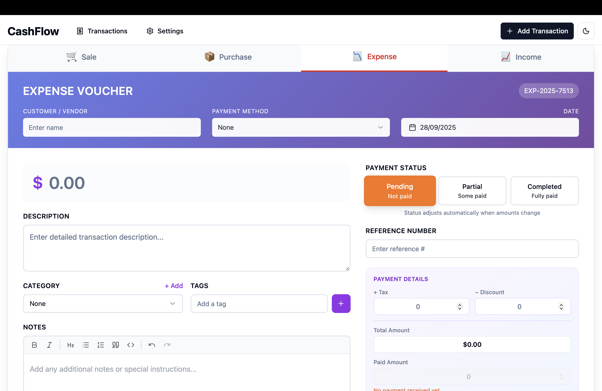

# CashFlow - Personal Finance Management Application



## 📊 Overview

CashFlow is a modern, desktop-based personal finance management application built with **Wails**, **Go**, and **React**. It provides an intuitive interface for tracking income, expenses, sales, and purchases, helping users maintain better control over their financial transactions.

## ✨ Features

### 💰 Transaction Management
- **Multiple Transaction Types**: Track income, expenses, sales, and purchases
- **Smart Payment Status**: Automatically calculates payment status based on paid amounts
- **Partial Payments**: Support for tracking partial payments with automatic due amount calculation
- **Bulk Operations**: Select and manage multiple transactions at once
- **Advanced Filtering**: Filter by date, type, category, payment status, and more

### 📝 Smart Form Experience
- **Interactive Payment Status**: Click-based status selection with automatic paid amount adjustment
- **Auto-calculation**: Real-time calculation of totals, taxes, discounts, and due amounts
- **Recurring Transactions**: Set up recurring income or expenses with customizable frequencies
- **Tag System**: Organize transactions with custom tags for better categorization

### 📈 Financial Insights
- **Dashboard Statistics**: View total income, expenses, net profit at a glance
- **Category Summaries**: Analyze spending patterns by category
- **Payment Method Tracking**: Monitor how payments are made and received
- **Transaction History**: Complete audit trail with creation and modification timestamps

### 🎨 Modern User Interface
- **Clean Design**: Modern, responsive interface with smooth animations
- **Dark Mode Support**: Built-in theme system for comfortable viewing
- **Color-coded Statuses**: Visual indicators for payment statuses and transaction types
- **Customizable Views**: Table, grid, and calendar views for transaction display

### 🔧 Settings & Customization
- **Category Management**: Create and manage custom income/expense categories
- **Payment Methods**: Define custom payment methods (Cash, Credit Card, Bank Transfer, etc.)
- **Form Field Visibility**: Customize which fields appear in transaction forms
- **Column Configuration**: Show/hide and reorder table columns to preference

## 🛠️ Technology Stack

### Backend
- **Go** - High-performance backend logic
- **SQLite** - Lightweight, embedded database
- **SQLC** - Type-safe SQL queries
- **Goose** - Database migrations

### Frontend
- **React 18** - Modern UI framework
- **TypeScript** - Type-safe frontend development
- **Tailwind CSS** - Utility-first CSS framework
- **Vite** - Fast build tool and dev server
- **Zustand** - State management
- **React Hook Form** - Form handling
- **Recharts** - Data visualization

### Framework
- **Wails v2** - Build desktop apps using Go & Web Technologies

## 📦 Installation

### Prerequisites
- Go 1.21 or later
- Node.js 18 or later
- Wails CLI v2.10 or later

### Setup

1. **Clone the repository**
```bash
git clone https://github.com/yourusername/cashflow.git
cd cashflow
```

2. **Install Wails CLI**
```bash
go install github.com/wailsapp/wails/v2/cmd/wails@latest
```

3. **Install dependencies**
```bash
# Install Go dependencies
go mod download

# Install frontend dependencies
cd frontend
npm install
cd ..
```

4. **Run database migrations**
```bash
# The app will automatically run migrations on first launch
```

## 🚀 Development

### Live Development Mode
```bash
wails dev
```
This will start:
- Backend server with hot reload
- Frontend dev server at http://localhost:34115
- Automatic recompilation on file changes

### Building for Production
```bash
wails build
```
This creates an optimized application bundle in the `build/bin` directory.

### Platform-specific builds
```bash
# Windows
wails build -platform windows/amd64

# macOS
wails build -platform darwin/universal

# Linux
wails build -platform linux/amd64
```

## 📁 Project Structure

```
cashflow/
├── app.go                 # Main application entry point
├── main.go               # Wails initialization
├── internal/             # Internal Go packages
│   ├── db/              # Database queries and models
│   ├── services/        # Business logic services
│   └── database/        # Database connection and setup
├── migrations/           # SQL migration files
├── frontend/            # React frontend application
│   ├── src/
│   │   ├── components/  # React components
│   │   ├── pages/      # Page components
│   │   ├── stores/     # Zustand stores
│   │   ├── types/      # TypeScript types
│   │   └── lib/        # Utility functions
│   └── wailsjs/        # Auto-generated Wails bindings
└── build/              # Build outputs
```

## 🔑 Key Features Explained

### Smart Payment Status System
The application features an intelligent payment tracking system:
- **Pending**: No payment received (paid amount = 0)
- **Partial**: Some payment received (0 < paid amount < total)
- **Completed**: Fully paid (paid amount ≥ total)
- Automatic status adjustment when amounts change

### Database Schema Highlights
- **Transactions**: Core table with calculated net_amount
- **Categories**: Hierarchical categories for income/expense
- **Payment Methods**: Customizable payment options
- **Soft Deletes**: All records use soft delete for data integrity

### Migration System
The application uses the new `paid_amount` system instead of `due_amount`:
- More intuitive data entry
- Automatic calculation of remaining dues
- Better financial tracking

## 🤝 Contributing

Contributions are welcome! Please feel free to submit a Pull Request.

1. Fork the project
2. Create your feature branch (`git checkout -b feature/AmazingFeature`)
3. Commit your changes (`git commit -m 'Add some AmazingFeature'`)
4. Push to the branch (`git push origin feature/AmazingFeature`)
5. Open a Pull Request

## 📄 License

This project is licensed under the MIT License - see the LICENSE file for details.

## 🙏 Acknowledgments

- Built with [Wails](https://wails.io/) - The fantastic framework for building desktop apps
- UI components from [shadcn/ui](https://ui.shadcn.com/)
- Icons from [Lucide](https://lucide.dev/)

## 📞 Support

For support, please open an issue in the GitHub repository or contact the maintainers.

---

**Note**: This is a desktop application and requires a proper Wails environment to run. It cannot be deployed as a web application without significant modifications.